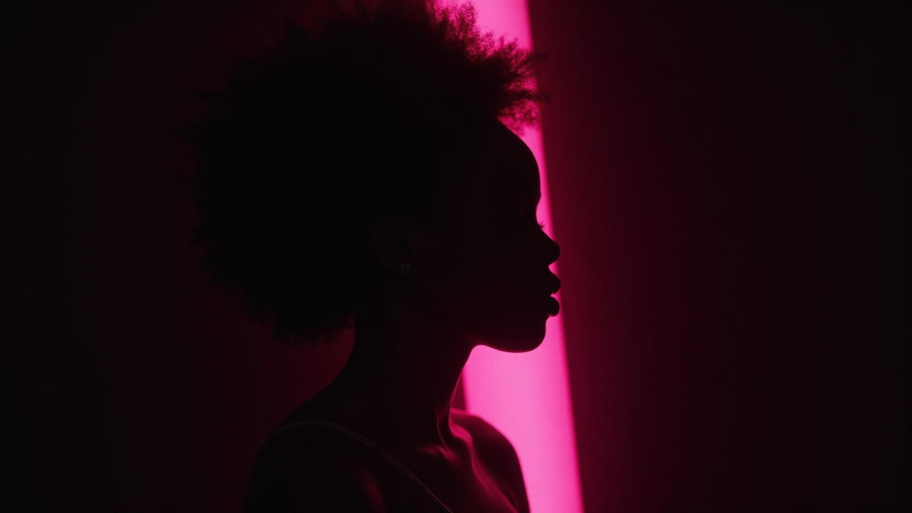

# 🌹 Joyeux Anniversaire Ursule

Une expérience web immersive et émotionnelle créée spécialement pour célébrer Ursule OWOLABI.



## ✨ Fonctionnalités

- 🎵 **Lecteur de musique personnalisé**
  - 3 pistes audio dédiées
  - Contrôles intuitifs
  - Effets visuels synchronisés
  
- 🎨 **Design élégant**
  - Thème rose et noir
  - Effets de brillance et de fondu
  - Interface réactive et fluide
  
- 💝 **Messages personnalisés**
  - Citations touchantes
  - Animations délicates
  - Expérience immersive

## 🚀 Technologies utilisées

- ⚛️ React + Vite
- 🎯 TypeScript
- 🎨 Tailwind CSS
- ✨ Shadcn/ui
- 🎵 Audio Web API

## 🛠️ Installation

1. Clonez le dépôt :
```bash
git clone https://github.com/T0b0i7/ursulesowolabi-hbd.git
```

2. Installez les dépendances :
```bash
cd ursulesowolabi-hbd
npm install
```

3. Lancez le serveur de développement :
```bash
npm run dev
```

## 💖 Message spécial

Ce site est une création unique, conçue avec amour et attention pour célébrer une personne exceptionnelle. Chaque élément, des animations aux mélodies, a été choisi pour créer une expérience mémorable.

## 🎨 Aperçu des sections

### Section Hero
Une introduction visuelle saisissante avec un effet de fondu rose et noir, mettant en valeur l'essence de la célébration.

### Lecteur de musique
Un composant interactif permettant de profiter de mélodies soigneusement sélectionnées, chacune portant un message unique.

### Messages personnalisés
Des sections dédiées aux vœux et aux souhaits, présentées avec des animations élégantes et des effets visuels subtils.

## 🌟 Crédits

Développé avec 💖 par [T0b0i7](https://github.com/T0b0i7)

---

*Une âme en rose et noir* 🌹✨
npm run dev
```

## Technologies

- Vite
- TypeScript
- React
- Tailwind CSS

Vous pouvez éditer le code localement avec votre IDE habituel et pousser sur Git si nécessaire.
